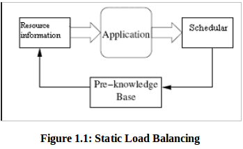
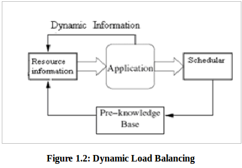

### [Load Balancing Algorithm](https://github.com/mohan08p/ComputerEngineeringLabs/blob/master/Academics/B.E./SEM%20II/PDS%20Labs/Exp%201%20:%20Load%20Balancing%20Algorithm/static-load-balancing.png)

It distributes workloads across multiple computing resources such as, computers, a computer cluster, network links, central processing units or disk drives. Load balancing aims to optimize resource use, maximize throughput, minimize response time, and avoid overload of any single resource. Using multiple components with load balancing instead of a single component may increase reliability and availability through redundancy. Load balancing usually involves dedicated software or hardware, such as a multilayer switch or a Domain Name System server process.

Here, in this program we have shown the simple implementation of load balancing server where the processing load tries to distribute it equally onto the different nodes based on two parameters, cpu and Processors. And we can tell the user to add or remove these resources and it will dynamically adjust the load onto the nodes, respectively.

### [Static Load Balancing](https://github.com/mohan08p/ComputerEngineeringLabs/blob/master/Academics/B.E./SEM%20II/PDS%20Labs/Exp%201%20:%20Load%20Balancing%20Algorithm/static-load-balancing.png)

static-load-balancing

### [Dynamic Load Balancing](https://github.com/mohan08p/ComputerEngineeringLabs/blob/master/Academics/B.E./SEM%20II/PDS%20Labs/Exp%201%20:%20Load%20Balancing%20Algorithm/dynamic-load-balancing.png)

dynamic-load-balancing

